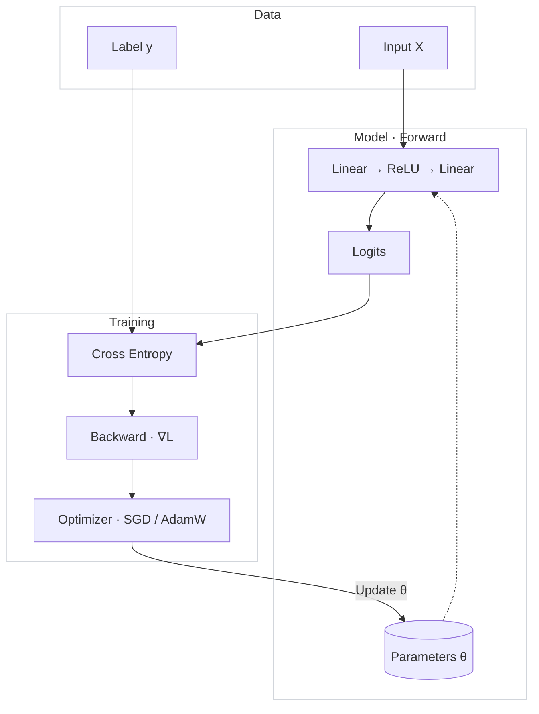

整体来看，深度学习的核心链路是：

```mermaid
flowchart TB
    subgraph DATA["Data"]
        X["Input X"]
        Y["Label y"]
    end

    subgraph MODEL["Model · Forward"]
        direction TB
        P[("Parameters θ")]
        F["Linear → ReLU → Linear"]
        Z["Logits"]
        P -.-> F
        F --> Z
    end

    subgraph TRAIN["Training"]
        L["Cross Entropy"]
        G["Backward · ∇L"]
        O["Optimizer · SGD / AdamW"]
        L --> G --> O
    end

    X --> F
    Y --> L
    Z --> L
    O -- "Update θ" --> P


    style DATA fill:none,stroke:#d1d5db
    style MODEL fill:none,stroke:#d1d5db
    style TRAIN fill:none,stroke:#d1d5db
```
