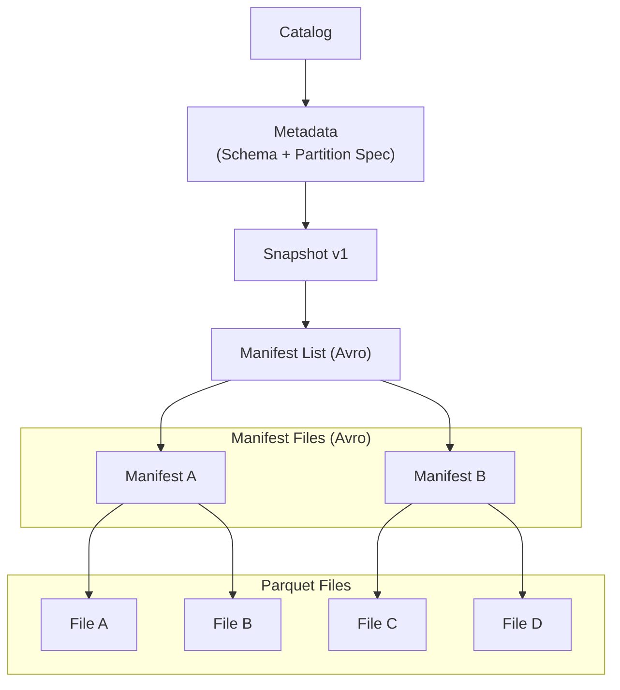

```mermaid
flowchart TB
    CAT["Catalog"]

    META["Metadata<br> (Schema + Partition Spec)"]

    SNAP["Snapshot v1"]
    ML["Manifest List (Avro)"]

    subgraph MANIFESTS ["Manifest Files (Avro)"]
        direction LR
        MF1["Manifest A"]
        MF2["Manifest B"]
    end

    subgraph DATA [Parquet Files]
        direction LR
        PQ1["File A"]
        PQ2["File B"]
        PQ3["File C"]
        PQ4["File D"]
    end

    CAT --> META
    META --> SNAP
    SNAP --> ML
    ML --> MF1
    ML --> MF2

    MF1 --> PQ1
    MF1 --> PQ2
    MF2 --> PQ3
    MF2 --> PQ4
```

