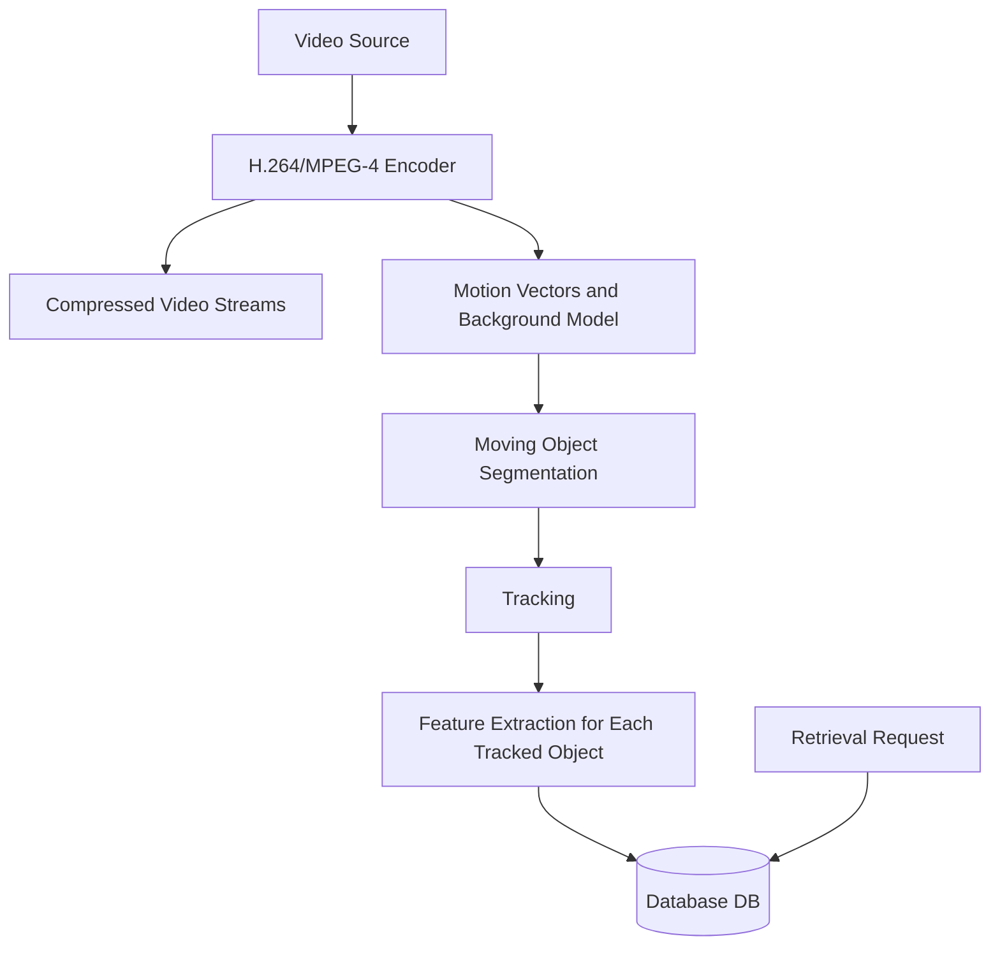

## Face Reconstruction

## Video Retrieval 

```mermaid
flowchart TD
    A[Video Source] --> B[H.264/MPEG-4 Encoder]
    B --> C[Compressed Video Streams]
    B --> D[Motion Vectors and Background Model]
    D --> E[Moving Object Segmentation]
    E --> F[Tracking]
    F --> G[Feature Extraction for Each Tracked Object]
    G --> H[(Database DB)]
    I[Retrieval Request] --> H
```
